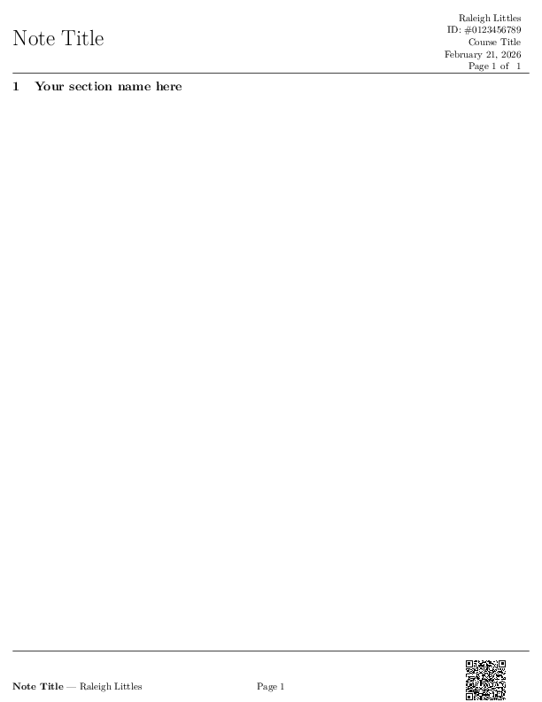
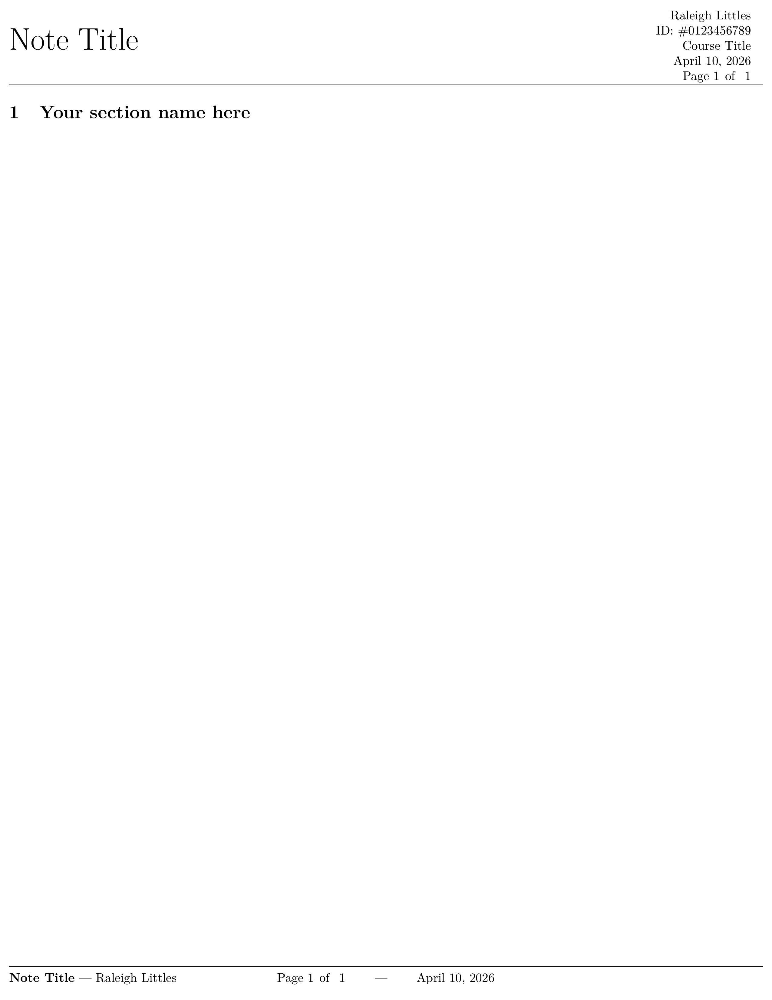
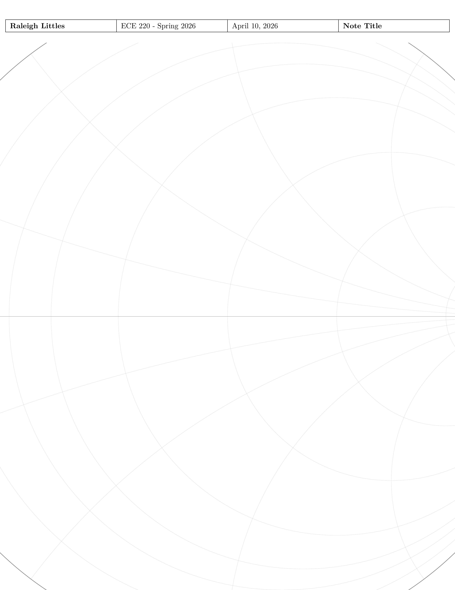
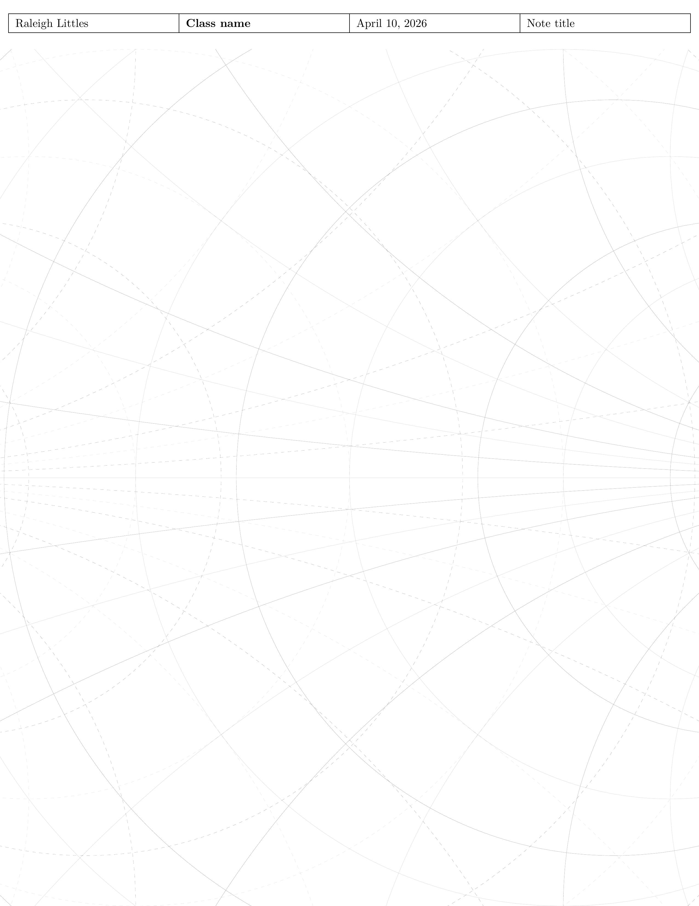
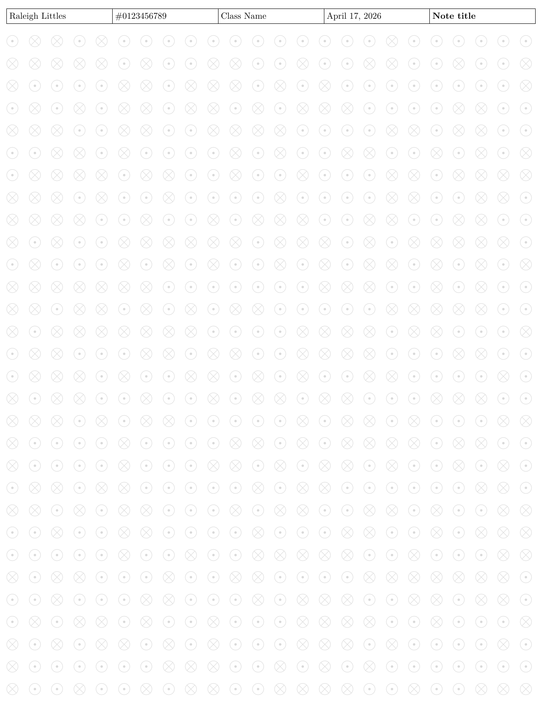
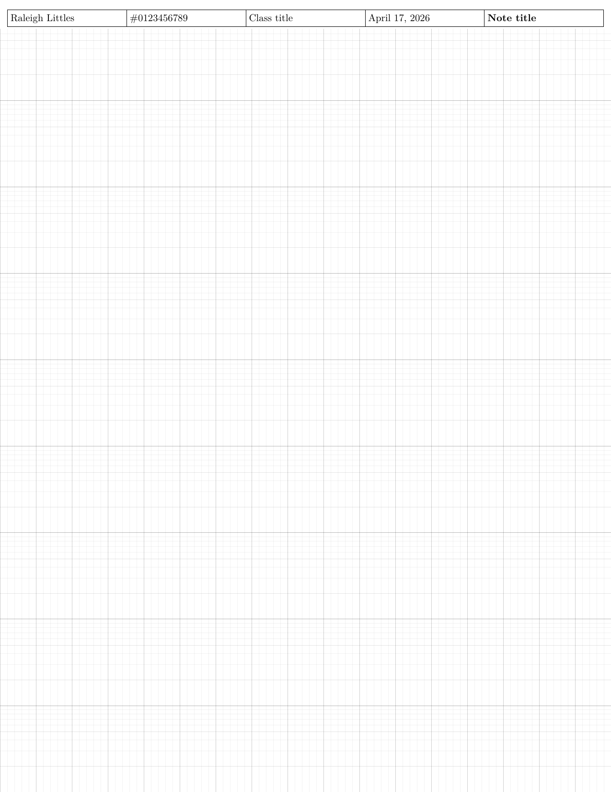

# About

LaTeX templates repository. Used for both LaTeX documents, as well as for creating templates to use in other apps (e.g. Notability, GoodNotes) as PDFs.

US Letter size (8.5 x 11) as well as ISO A4 size templates are available.

# Instructions

* Install LaTeX
* Clone this repository

For use with tablet writing apps, you'll need to first build the document, export the PDF file to your tablet and import it into the app of your choice.

If you're going to be working off the actual LaTeX document,
and you're using [TexMaker](https://www.xm1math.net/texmaker/),

I recommend doing 'File' -> 'New by copying an existing file'

# Images

These are the different types of templates available:

## Standard assignment template

Simple template for homework, notes, or lab reports.

Features a dual header and footer. Header contains sequence page numbers (x of y); while Footer contains title, name, current page number, and space for an approximately 1" x 1" image - useful for logos or copyright QR codes

Also works without images in the footer.

## Notability Grid

Standard Engineering Grid paper.

## Notability Honeycomb

Hexagonal/honeycomb layout useful for organic chemistry

## Notability Mizige

"Rice-shaped grid"

Originally used for people practicing Chinese characters. Engineering grid with diagonal lines.

## Notability Tianzege

"Field-shaped grid"

Originally used for people practicing Chinese characters.
Larger version of Engineering Grid.

## Notability Isometric

Useful for doing isometric drawings

## Notability Radial/Polar Log Graph

( Missing A4 version )

Useful for working with polar coordinates.

* Spokes are evenly spaced in angle (linear in degrees)
* Rings grow geometrically (log)

## Notability Smith Chart

( Missing A4 version )

<https://en.wikipedia.org/wiki/Smith_chart>

Used for Radio Frequency engineering.

Dual variant as well.

## Notability Magnetic Field Diagram

Randomized magnetic field diagram that covers entire page. Changeable via seed.

## Notability Semi-Logarithmic Graph

Similar to engineering grid but with logarithm graph sizes.

## Notability Bode Plot background (WIP)

2 bode plots per page (arranged vertically). Needs better fixing of opacity.
